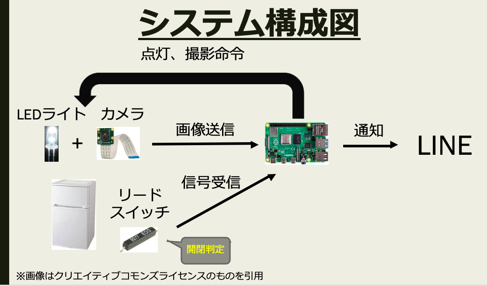

# カメラによる冷蔵庫の内容物確認システム

Web×IoTハッカソンにて作成  
<br>
## 必要な材料
Raspberry Pi Zero W, SDカード, リードスイッチ, 磁石, LED, USBカメラまたはカメラモジュール, ブレッドボード, ジャンパー線, 抵抗(必要であれば)   
<br>

## システム概要
1. 冷蔵庫が閉まったときリードスイッチが反応し、LEDが点灯、USBカメラで撮影する
2. 指定された時間にカメラで撮影された際椎の画像をLINE Notify APIでLINEに通知する  
<br>

  
カメラのところはカメラモジュールでもUSBカメラでも良い  
<br>

- ___必要なライブラリをインストール___
```
＃OpenCV
sudo apt-get install libhdf5-dev libhdf5-serial-dev libhdf5-100
sudo apt-get install libqtgui4 libqtwebkit4 libqt4-test python3-pyqt5
sudo apt-get install libatlas-base-dev
sudo apt-get install libjasper-dev
sudo pip3 --default-timeout=1000 install opencv-python

＃schdule
sudo pip3 install schedule
```
